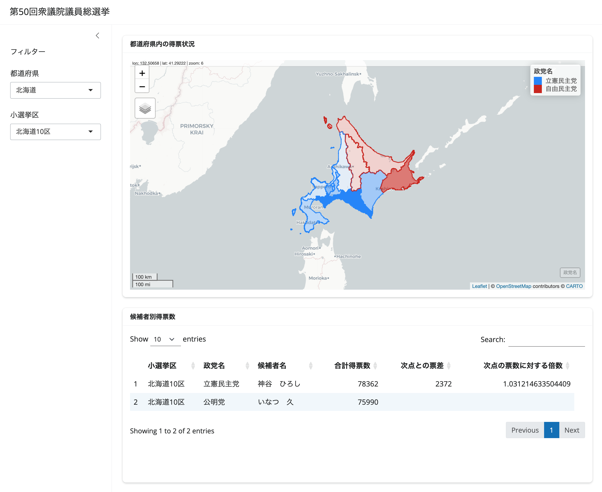

## 第50回衆議院議員総選挙の視覚化

Shinyを使用した2024年10月に実施された第50回衆議院議員総選挙速報結果の視覚化

### 使用方法

1.  （renvをインストールしていない場合）CRANからrenvをインストール
2.  `renv::restore()`を実行
3.  app.Rを実行

### データソース

このリポジトリのコード内で使用するデータのソースは以下のとおりです。

#### 選挙結果

[令和6年10月27日執行　衆議院議員総選挙・最高裁判所裁判官国民審査　速報結果](https://www.soumu.go.jp/senkyo/senkyo_s/data/shugiin50/index.html){.uri}

#### 小選挙区のポリゴンデータ

[2022年(令和4年)改訂の289小選挙区の統計データ及び地図データ](https://gtfs-gis.jp/senkyoku/){.uri}

### 免責事項

本リポジトリは、R言語およびShinyを用いたデータの視覚化を練習することを目的としています。本リポジトリ内のコードやその成果物は、特定の政党または政治団体への支持・不支持を意図するものではありません。

本リポジトリ内のコードを使用または実行したことにより生じたいかなる不利益・損害についても、当方は一切の責任を負いかねます。あらかじめご了承ください。
